<div align="center">


<br/><br/>

<table>
<tr>
<td align="center" width="110">
  <br/>
  <sub><b>Angular</b></sub>
</td>
<td align="center" width="110">
  <br/>
  <sub><b>Spring Boot</b></sub>
</td>
<td align="center" width="110">
  <br/>
  <sub><b>Java 21</b></sub>
</td>
<td align="center" width="110">
  <br/>
  <sub><b>Kafka</b></sub>
</td>
<td align="center" width="110">
  <br/>
  <sub><b>PostgreSQL</b></sub>
</td>
<td align="center" width="110">
  <br/>
  <sub><b>Redis</b></sub>
</td>
<td align="center" width="110">
  <br/>
  <sub><b>Docker</b></sub>
</td>
</tr>
</table>

<br/>

<table>
<tr>
<td align="center" width="230">
  <br/>
  <b>Modular Monolith</b><br/><sub>Phased, containerized build</sub>
</td>
<td align="center" width="230">
  <br/>
  <b>Project-Scoped RBAC</b><br/><sub>(user, project, role) triples</sub>
</td>
<td align="center" width="230">
  <br/>
  <b>Permission-Scoped RAG</b><br/><sub>Filtered before the model sees it</sub>
</td>
</tr>
<tr>
<td align="center" width="230">
  <br/>
  <b>Append-Only History</b><br/><sub>Nothing is ever overwritten</sub>
</td>
<td align="center" width="230">
  <br/>
  <b>Generic Approval Engine</b><br/><sub>New types = configuration</sub>
</td>
<td align="center" width="230">
  <br/>
  <b>SLA Auto-Escalation</b><br/><sub>Nothing gets silently ignored</sub>
</td>
</tr>
</table>

<br/>

<p>
  
  
  
  
</p>

**[Overview](#-overview)** ·
**[Architecture](#-architecture)** ·
**[AI Assistant](#-ai-assistant-architecture)** ·
**[Tech Stack](#-tech-stack)** ·
**[Roadmap](#-development-roadmap)** ·
**[Run Locally](#-running-locally)**

</div>

---

## 🚀 Overview

[#-overview](#-overview)

**OPERIVA OS** replaces scattered email chains, verbal approvals, and disconnected spreadsheets with one auditable digital record of a project's entire lifecycle — intake, requirement capture, budgeting, multi-level approval, execution, and closure.

The engine is **domain-agnostic**: the same workflow core that runs a corporate project pipeline can run a law firm's matter-approval process or a government permit workflow — only the labels change.

**Built for:** 🏢 Corporates · ⚖️ Law firms · 🏛️ Government bodies · 🤝 NGOs & SMBs

---

## ✨ Features

[#-features](#-features)

- Auto-coded project containers — no manual numbering
- CEO/Board feasibility gate with auto-generated client confirmation
- Chronological, permanent meeting/progress log per project
- Requirements & budget as **versioned, append-only** revision chains — never overwritten
- Generic, configuration-driven **Approval Chain engine** (Manager → Finance → CEO/Board)
- Three decision outcomes per level: approve, reject, request clarification (with loop-back)
- **SLA-based auto-escalation** — no silently-ignored approvals
- Strict **project-scoped RBAC** — a Manager sees only their assigned projects
- Cross-department request routing (budget / asset / HR tickets)
- Embedded, **role-aware AI assistant** scoped to exactly what the asker is permitted to see
- Full **append-only audit trail** on every state transition
- Event-driven core (Kafka) — async fan-out to notifications, audit log, and AI ingestion

---

## 🏗 Architecture

[#-architecture](#-architecture)

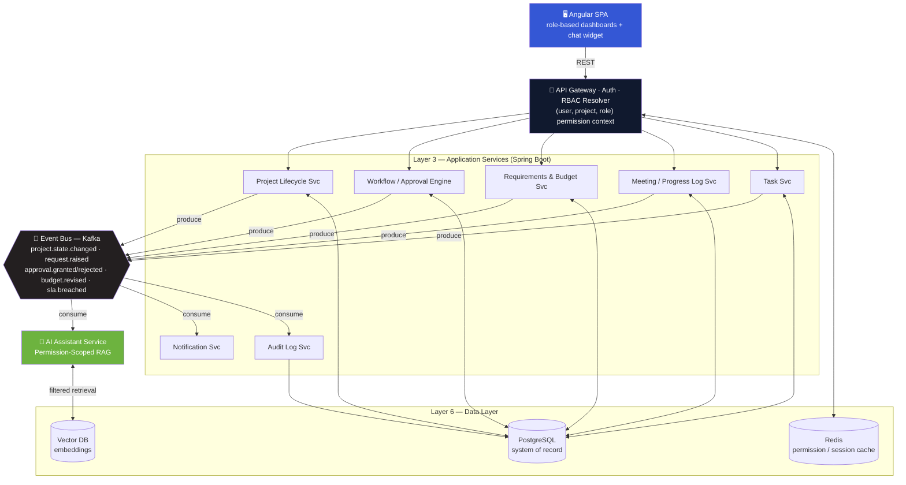

> Synchronous calls (REST) flow top-to-bottom through the Gateway and Services. Asynchronous propagation (Kafka) fans out from the Event Bus to Notifications, Audit Log, and the AI ingestion pipeline.

### Full end-to-end workflow — intake to closure

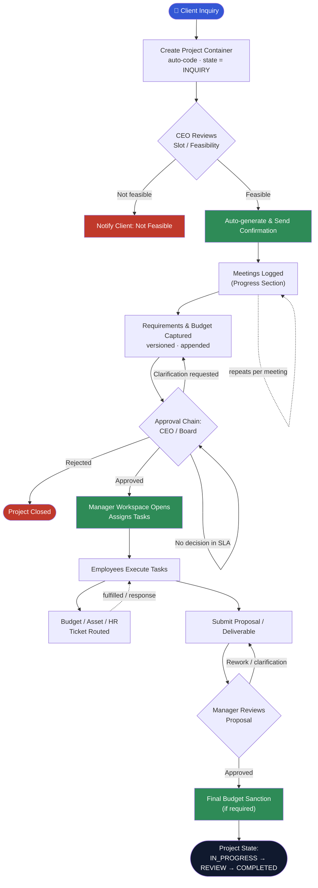

> Every step across the whole flow publishes to Kafka and is written to `AuditLog` with actor + timestamp — queryable by the role-scoped AI Assistant, subject to the same RBAC boundary as the UI. `ON_HOLD` is reachable from any state.

---

## ⚙ Components

[#-components](#-components)

| Service | Responsibility |
|---|---|
| **Project Lifecycle Svc** | Owns the `Project` entity and its state machine; auto-generated project codes; CEO feasibility review |
| **Workflow / Approval Engine** | A **generic** `ApprovalChain` + `ApprovalStep` model — configurable levels, per-level approver role, per-chain SLA. Reused as-is for budget, asset, and HR requests |
| **Requirements & Budget Svc** | Append-only revision chains (self-referencing `supersedes_id`) with a materialized "current" pointer — full history, no overwrites |
| **Meeting / Progress Log Svc** | Chronological, searchable, permanent log of every meeting tied to a project |
| **AI Assistant Svc** | Permission-scoped RAG — retrieval happens inside the user's permission boundary before the model ever sees the data |
| **Notification / Audit Log Svc** | Consumes Kafka events to dispatch notifications and write an immutable audit record of every transition |

---

## 🧠 AI Assistant Architecture

[#-ai-assistant-architecture](#-ai-assistant-architecture)

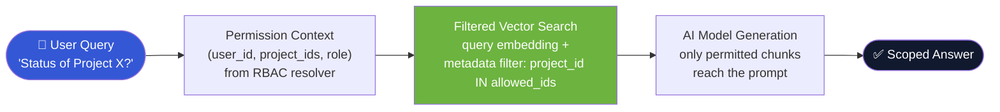

**Guardrails**

1. The retrieval filter is enforced at the **vector-store query level**, never via prompt instructions.
2. The AI model is never given a tool that can bypass the filter (e.g. raw SQL access).
3. Every AI answer logs which chunks were retrieved, for audit purposes.

**Ingestion pipeline** runs continuously via Kafka consumers — meeting notes, requirement revisions, task updates, and approval decisions are chunked and embedded as they're created, each tagged with `project_id`, `allowed_roles`, `entity_type`, `created_at`.

| Component | Free / Open-Source | Paid Alternative |
|---|---|---|
| Orchestration | LangChain / LlamaIndex | Managed RAG-as-a-service |
| Embeddings | Sentence-Transformers, BGE (local) | OpenAI / Cohere embedding APIs |
| Vector DB | FAISS, Chroma, Qdrant (self-hosted) | Pinecone, Weaviate Cloud |
| Generation model | Llama 3 / Mistral / Phi-3 via Ollama | Claude API / GPT API |
| Reranking (optional) | Open-source cross-encoders | Cohere Rerank API |

> Recommended path: validate the RBAC-scoped retrieval architecture against the **free, self-hosted stack** first (LangChain + Sentence-Transformers + Chroma + Ollama); swap in a hosted API only once answer quality needs to improve for production.

---

## 🔁 Budget Request — Sequence Diagram

[#-budget-request--sequence-diagram](#-budget-request--sequence-diagram)

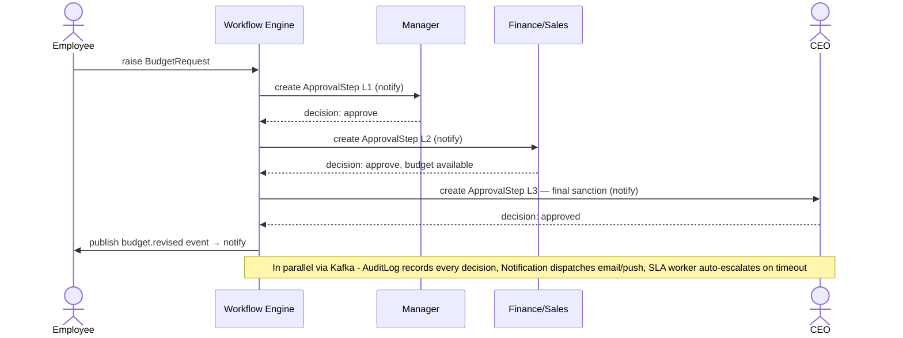

---

## 🔐 Role-Based Access Model

[#-role-based-access-model](#-role-based-access-model)

| Role | Visibility Scope | Cannot See |
|---|---|---|
| 👑 **CEO / Board** | All projects, budgets, meetings, approvals, org-wide analytics | — |
| 🧑‍💼 **Manager** | Only assigned projects — requirements, tasks, progress | Other managers' projects, board notes, org-wide budgets |
| 🧑‍💻 **Employee** | Only their own assigned tasks + relevant requirements | Project budget, other employees' tasks, meeting/approval history |
| 💰 **Finance / Sales / HR** | Only the specific request ticket routed to them | Full project context, other departments' tickets |

Enforced at two points: **(1)** the API Gateway resolves and attaches the permission context to every request, and **(2)** the AI Assistant's retrieval layer applies the same filter before returning any content to the LLM.

---

## 🧬 Core Schema & State Machines

[#-core-schema--state-machines](#-core-schema--state-machines)

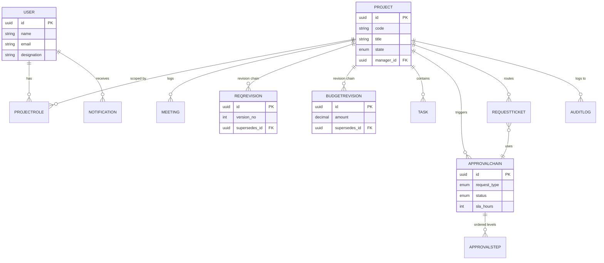

**Project lifecycle**

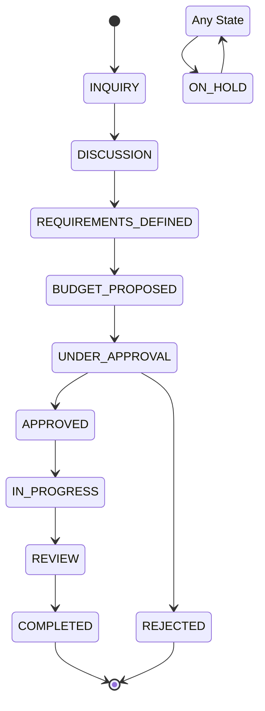

**Generic approval chain** (reused for Budget / Asset / Clarification requests)

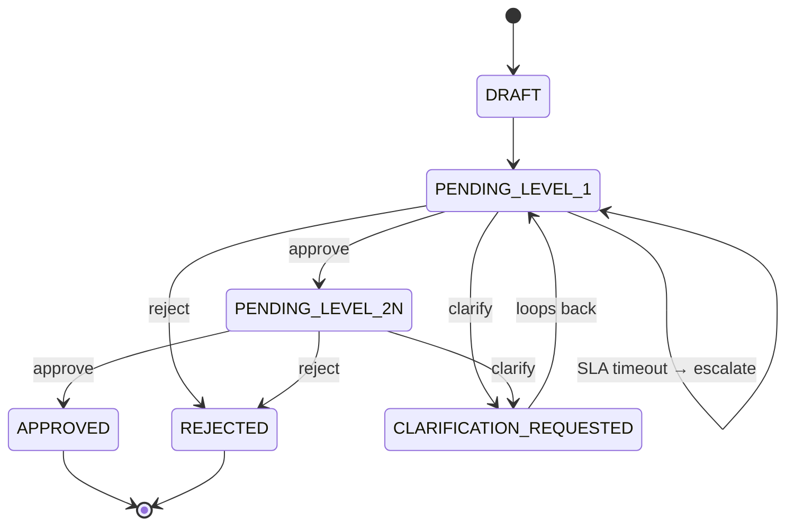

- `ReqRevision` and `BudgetRevision` are **append-only, self-referencing** (`supersedes_id`) — history is never lost.
- `ApprovalChain` + `ApprovalStep` is the **one generic engine** reused by `RequestTicket` for every request type.

---

## 🛠 Tech Stack

[#-tech-stack](#-tech-stack)

<div align="center">
<table>
<tr>
<td align="center" width="90"></td>
<td align="center" width="90"></td>
<td align="center" width="90"></td>
<td align="center" width="90"></td>
<td align="center" width="90"></td>
<td align="center" width="90"></td>
<td align="center" width="90"></td>
<td align="center" width="90"></td>
</tr>
</table>
</div>
<br/>

| Layer | Technology | Notes |
|---|---|---|
| Frontend framework | Angular 17+ (standalone components) | No NgModules needed |
| Frontend language | TypeScript 5.x | Strict mode enabled |
| Frontend styling | SCSS + CSS custom-property design tokens | See [Design System](#-frontend-design-system) |
| Backend framework | Spring Boot 3.x | Requires Java 17+ |
| Backend language | Java 21 (LTS) | |
| API style | REST (OpenAPI 3) | Sync service-to-service & client calls |
| Event streaming | Apache Kafka 3.x | State-change propagation, async fan-out |
| Relational database | PostgreSQL 16 | System of record, append-only revisions |
| Cache | Redis 7.x | Permission-context & session caching |
| Vector database | Chroma / Qdrant (free) or Pinecone (paid) | For the AI assistant |
| AI orchestration | LangChain | Retrieval, prompt assembly, chat memory |
| AI model | Claude / GPT API, or Llama 3 / Mistral via Ollama | Self-hosted-first path |
| Containerization | Docker | One image per service |
| Orchestration (prod) | Kubernetes (optional at scale) | Not required for MVP |
| CI/CD | GitHub Actions | Test → build → containerize → deploy |
| Cloud hosting | Azure App Service / AKS, or AWS/GCP equivalent | Vendor-agnostic |

---

## 🗂 Project Structure

[#-project-structure](#-project-structure)

```
operiva-os
│
├── frontend                     # Angular SPA
│   ├── app-shell                # sidebar, topbar, route guards
│   ├── dashboard
│   ├── project-list
│   ├── project-detail           # Overview / Progress / Req+Budget / Tasks / Approvals
│   └── chat-widget               # AI assistant UI
│
├── services
│   ├── lifecycle-svc             # Project entity + state machine
│   ├── workflow-svc               # Generic ApprovalChain engine
│   ├── rbac-svc                   # Auth + (user, project, role) resolver
│   ├── requirements-budget-svc
│   ├── progress-svc               # Meeting log
│   ├── task-svc
│   ├── notification-svc
│   ├── audit-log-svc
│   └── ai-assistant-svc           # Python + LangChain, permission-scoped RAG
│
├── infra
│   ├── docker-compose.yml         # full local stack
│   └── github-actions/            # CI/CD pipeline definitions
│
└── docs                           # ER diagram, state machines, RBAC model
```

---

## 🎨 Frontend Design System

[#-frontend-design-system](#-frontend-design-system)

- **Palette:** deep navy ink `#10192E` (sidebar/header), soft canvas `#F5F7FB` (background), royal-blue `#3457D5` (primary actions)
- **State colors:** blue (early stage) · amber (under approval) · green (approved/complete) · red (rejected) · purple (on-hold/clarification)
- **Typography:** Fraunces (serif) for titles/wordmark, Inter (sans) for functional UI
- **Signature element — the Lifecycle Rail:** a segmented progress bar showing a project's exact state-machine position, used on dashboard cards, table rows, and the detail header
- **Responsive:** sidebar → slide-in drawer below 1024px; tables → stacked cards below 860px; stat grids reflow 4 → 1 column
- **Accessibility:** visible keyboard focus rings, `prefers-reduced-motion` respected

| Screen | What it shows |
|---|---|
| Login | Minimal, enterprise-styled sign-in |
| Dashboard | Role-aware stat cards, "projects in motion" feed, activity panel |
| Project List | Filterable by lifecycle state; table (desktop) / cards (mobile) |
| Project Detail | Overview · Progress · Requirements & Budget (RBAC-restricted) · Tasks · Approvals |

---

## 🐳 Running Locally

[#-running-locally](#-running-locally)

```bash
git clone https://github.com/<your-org>/operiva-os.git
cd operiva-os
docker compose up
```

`docker-compose.yml` brings up every backend service plus **PostgreSQL, Redis, Kafka, and the vector database** in one command:

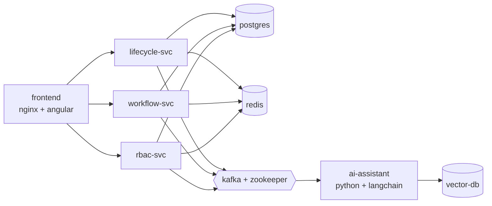

Each backend Dockerfile is **multi-stage**: a build stage with the full SDK, and a slim `eclipse-temurin:21-jre-alpine` runtime — no build tools, no source code, minimal attack surface in the final image.

---

## 📊 Observability

[#-observability](#-observability)

Every `AuditLog` write and every AI retrieval is queryable alongside infrastructure metrics from day one.

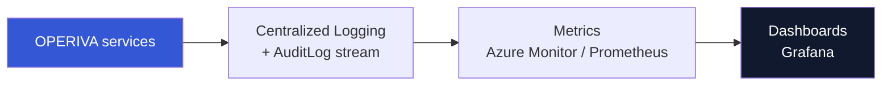

- **Secrets:** managed secret store (Azure Key Vault or equivalent) — never committed to source control, never baked into images.
- **Database:** managed PostgreSQL with automated backups and point-in-time recovery.
- Architecture is intentionally **cloud-vendor-agnostic** — every component has a direct equivalent on AWS or GCP.

---

## 🔁 CI/CD Pipeline

[#-cicd-pipeline](#-cicd-pipeline)

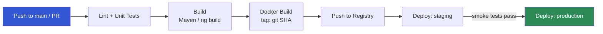

- A failing test blocks the merge.
- Images are tagged with the **Git commit SHA**, never overwriting `latest`.
- Production deploys require staging smoke tests to pass first; DB migrations run as a separate, reviewed step — never bundled silently into deploy.

---

## 🗺 Development Roadmap

[#-development-roadmap](#-development-roadmap)

10 weeks to a launch-ready MVP with a small, focused team (2–4 engineers).

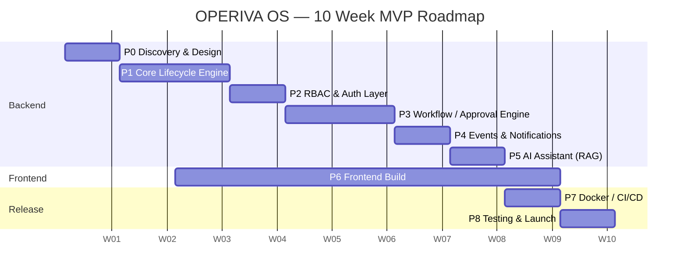

| Phase | Name | Duration | Primary Deliverable |
|---|---|---|---|
| 0 | Discovery & System Design | Week 1 | Finalized schema, API contracts, RBAC model |
| 1 | Core Lifecycle Engine | Week 2–3 | Project entity, state machine, meetings, versioned requirements/budget |
| 2 | RBAC & Auth Layer | Week 4 | JWT auth, project-scoped permission resolver |
| 3 | Workflow / Approval Engine | Week 5–6 | Generic ApprovalChain engine |
| 4 | Event Layer & Notifications | Week 6–7 | Kafka topics, SLA-escalation worker, dispatch |
| 5 | AI Assistant (RAG) | Week 7–8 | Role-scoped retrieval pipeline, chat UI |
| 6 | Frontend Build | Week 3–9 (parallel) | All role-based screens, fully responsive |
| 7 | Docker, CI/CD & Deployment | Week 9 | Containerized services, automated pipeline |
| 8 | Testing, Hardening & Launch | Week 10 | End-to-end pass, production launch |

---

## ⚠️ Risks & Mitigations

[#️-risks--mitigations](#️-risks--mitigations)

| Risk | Mitigation |
|---|---|
| RBAC modeled as simple global roles instead of project-scoped | Freeze the `(user, project, role)` model in Phase 0 before dependent code exists |
| Budget/requirements stored as mutable fields | Append-only revision tables from day one, never retrofitted |
| AI retrieval not scoped at the vector-store level | Enforce the permission filter in the vector query itself, never via prompts alone |
| All modules attempted simultaneously | Strict phase boundaries with defined exit criteria |
| Notification spam from naive SLA reminders | Escalate to the next level on timeout rather than re-pinging the same approver |
| Premature microservice split | Modular monolith first; extract only services whose load genuinely diverges |

---

## 💡 Design Principles

[#-design-principles](#-design-principles)

- Single source of truth for the entire project lifecycle
- Full, append-only audit trail — strong fit for regulated sectors
- One generic workflow engine reused across every approval type
- Project-scoped RBAC by design, not by convention
- Permission-scoped AI retrieval, never prompt-only guardrails
- Domain-agnostic core — usable well beyond one industry
- Ship in bounded phases — a working system exists early

---

## 📌 Applicable Domains

[#-applicable-domains](#-applicable-domains)

<div align="center">
<table>
<tr>
<td align="center" width="140"><br/><sub><b>Corporates</b></sub></td>
<td align="center" width="140"><br/><sub><b>Government</b></sub></td>
<td align="center" width="140"><br/><sub><b>Law Firms</b></sub></td>
<td align="center" width="140"><br/><sub><b>NGOs</b></sub></td>
<td align="center" width="140"><br/><sub><b>SMBs</b></sub></td>
</tr>
</table>
</div>

---

## 📄 License

[#-license](#-license)

MIT — see [`LICENSE`](./LICENSE) for details.

<div align="center">

</div>
